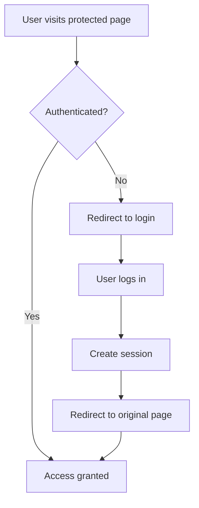

# Recipe Book Application

A full-stack web application for discovering, creating, and managing recipes with social features like favorites and comments.

##  User Interaction Flow
### Anonymous User Journey
1. **Browse Recipes** → View recipe grid without authentication
2. **View Recipe Details** → Full recipe information, comments visible
3. **Attempt Social Action** → Redirected to login/signup
4. **Complete Registration** → Auto-redirect back to intended action

### Authenticated User Journey
1. **Enhanced Browsing** → Heart icons, personalized recommendations
2. **Recipe Management** → Create, edit, delete own recipes
3. **Social Features** → Favorite recipes, leave comments and ratings
4. **Personal Dashboard** → View favorites, manage own recipes

## 🛠️ Technology Stack

### Frontend
- **React 19.1.0** - UI framework
- **React Router 7.6.2** - Client-side routing
- **Vite 6.3.5** - Build tool and dev server
- **Formik 2.4.6** - Form handling
- **Yup 1.6.1** - Form validation

### Backend
- **Flask** - Web framework
- **SQLAlchemy** - ORM
- **Flask-Migrate** - Database migrations
- **Flask-Bcrypt** - Password hashing
- **Flask-CORS** - Cross-origin resource sharing

### Database
- **SQLite** - Development database
- **sqlalchemy-serializer** - Model serialization

## 📊 Database Schema

```sql
Users
├── id (Primary Key)
├── username (Unique)
├── email (Unique)
└── password_hash

Categories
├── id (Primary Key)
└── name (Unique)

Recipes
├── id (Primary Key)
├── name
├── description
├── ingredients (Text)
├── instructions (Text)
├── prep_time (Integer)
├── cook_time (Integer)
├── image_url
├── user_id (Foreign Key → Users)
└── category_id (Foreign Key → Categories)

Comments
├── id (Primary Key)
├── text
├── rating (1-5)
├── created_at
├── user_id (Foreign Key → Users)
└── recipe_id (Foreign Key → Recipes)

FavoriteRecipes
├── id (Primary Key)
├── user_id (Foreign Key → Users)
└── recipe_id (Foreign Key → Recipes)
```

## 🔌 API Endpoints

### Authentication Endpoints

#### `POST /signup`
Create a new user account.

**Request Body:**
```json
{
  "username": "string",
  "email": "string",
  "password": "string"
}
```

**Response (201):**
```json
{
  "message": "User created successfully",
  "user": {
    "id": 1,
    "username": "john_doe",
    "email": "john@example.com"
  }
}
```

**Error Response (400):**
```json
{
  "error": "Username already exists"
}
```

#### `POST /login`
Authenticate user and create session.

**Request Body:**
```json
{
  "username": "string",
  "password": "string"
}
```

**Response (200):**
```json
{
  "message": "Login successful",
  "user": {
    "id": 1,
    "username": "john_doe",
    "email": "john@example.com"
  }
}
```

#### `DELETE /logout`
End user session.

**Response (200):**
```json
{
  "message": "Logout successful"
}
```

#### `GET /check_session`
Verify current session status.

**Response (200):**
```json
{
  "logged_in": true,
  "user": {
    "id": 1,
    "username": "john_doe",
    "email": "john@example.com"
  }
}
```

### Recipe Endpoints

#### `GET /recipes`
Retrieve all recipes.

**Response (200):**
```json
[
  {
    "id": 1,
    "name": "Chocolate Cake",
    "description": "Rich chocolate dessert",
    "ingredients": "Flour, Sugar, Cocoa...",
    "instructions": "1. Preheat oven...",
    "prep_time": 15,
    "cook_time": 30,
    "image_url": "https://example.com/cake.jpg",
    "user_id": 1,
    "category_id": 1
  }
]
```

#### `GET /recipes/{id}`
Retrieve specific recipe with full details.

**Response (200):**
```json
{
  "id": 1,
  "name": "Chocolate Cake",
  "description": "Rich chocolate dessert",
  "ingredients": "Flour, Sugar, Cocoa, Eggs, Butter",
  "instructions": "1. Preheat oven to 350°F...",
  "prep_time": 15,
  "cook_time": 30,
  "image_url": "https://example.com/cake.jpg",
  "user": {
    "id": 1,
    "username": "chef_alice"
  },
  "category": {
    "id": 1,
    "name": "Dessert"
  },
  "comments": [
    {
      "id": 1,
      "text": "Amazing recipe!",
      "rating": 5,
      "created_at": "2024-01-15T10:30:00",
      "user": {
        "username": "foodie_bob"
      }
    }
  ]
}
```

#### `POST /recipes` 🔒
Create new recipe (requires authentication).

**Request Body:**
```json
{
  "name": "New Recipe",
  "description": "Recipe description",
  "ingredients": "Ingredient list",
  "instructions": "Step by step instructions",
  "prep_time": 10,
  "cook_time": 20,
  "image_url": "https://example.com/image.jpg",
  "category_id": 1
}
```

**Response (201):**
```json
{
  "id": 5,
  "name": "New Recipe",
  "description": "Recipe description",
  "user_id": 1,
  "category_id": 1,
  "created_at": "2024-01-15T10:30:00"
}
```

#### `PATCH /recipes/{id}` 🔒
Update existing recipe (requires ownership).

**Request Body:**
```json
{
  "name": "Updated Recipe Name",
  "prep_time": 15
}
```

**Response (200):**
```json
{
  "id": 1,
  "name": "Updated Recipe Name",
  "prep_time": 15,
  "updated_at": "2024-01-15T11:00:00"
}
```

#### `DELETE /recipes/{id}` 🔒
Delete recipe (requires ownership).

**Response (200):**
```json
{
  "message": "Recipe deleted successfully"
}
```

### User Recipe Endpoints

#### `GET /users/{user_id}/recipes`
Get all recipes by specific user.

**Response (200):**
```json
[
  {
    "id": 1,
    "name": "User's Recipe",
    "description": "Description",
    "created_at": "2024-01-15T10:30:00"
  }
]
```

### Favorite Recipe Endpoints

#### `POST /favorite_recipes` 🔒
Add recipe to favorites (requires authentication).

**Request Body:**
```json
{
  "recipe_id": 1
}
```

**Response (201):**
```json
{
  "id": 1,
  "user_id": 1,
  "recipe_id": 1,
  "created_at": "2024-01-15T10:30:00"
}
```

#### `DELETE /favorite_recipes/{id}` 🔒
Remove recipe from favorites.

**Response (200):**
```json
{
  "message": "Favorite removed successfully"
}
```

#### `GET /users/{user_id}/favorite_recipes`
Get user's favorite recipes.

**Response (200):**
```json
[
  {
    "id": 1,
    "user_id": 1,
    "recipe_id": 1,
    "created_at": "2024-01-15T10:30:00"
  }
]
```

### Comment Endpoints

#### `POST /comments` 🔒
Add comment to recipe (requires authentication).

**Request Body:**
```json
{
  "text": "Great recipe!",
  "rating": 5,
  "recipe_id": 1
}
```

**Response (201):**
```json
{
  "id": 1,
  "text": "Great recipe!",
  "rating": 5,
  "user_id": 1,
  "recipe_id": 1,
  "created_at": "2024-01-15T10:30:00"
}
```

## 🎨 Frontend Implementation

### Component Architecture

```
App
├── ThemeProvider (Dark/Light mode context)
├── UserProvider (Authentication context)
├── NavBar (Navigation with conditional links)
└── Router
    ├── RecipeList (Public - Browse all recipes)
    ├── RecipeDetail (Public - View recipe details)
    ├── AuthPage (Public - Login/Signup forms)
    ├── CreateRecipeForm (Protected - Add new recipe)
    ├── EditRecipeForm (Protected - Edit own recipe)
    └── FavoriteRecipesList (Protected - User's favorites)
```

### State Management Flow

```javascript

{
  user: null | UserObject,        
  theme: 'light' | 'dark',         
  recipes: Recipe[],                
  favorites: FavoriteRecipe[],      
  loading: boolean,                 
  error: string | null              
}
```

### Key Frontend Features

#### 🔐 Route Protection
- **Public routes**: Home, recipe details, auth pages
- **Protected routes**: Create/edit recipes, favorites, profile
- **Automatic redirects**: Unauthenticated users redirected to login
- **Return navigation**: After login, redirect to originally requested page

#### 🎯 Optimistic Updates
- **Favorite toggling**: Immediate UI feedback
- **Error recovery**: Revert changes if API call fails
- **Loading states**: Visual feedback during operations

#### 📱 Responsive Design
- **Mobile-first**: Touch-friendly interface
- **Grid layouts**: Responsive recipe cards
- **Theme support**: Dark/light mode toggle
- **Accessibility**: Screen reader support, keyboard navigation

### Authentication Flow



## ⚙️ Backend Implementation

### Application Factory Pattern

```python
# app.py
def create_app():
    app = Flask(__name__)
    app.config.from_object(Config)
    
    # Initialize extensions
    db.init_app(app)
    migrate.init_app(app, db)
    bcrypt.init_app(app)
    CORS(app)
    
    # Register route handlers
    register_auth_routes(app)
    register_recipe_routes(app)
    register_favorite_routes(app)
    
    return app
```

### Session-Based Authentication

```python
# Session management
@app.route('/login', methods=['POST'])
def login():
    user = authenticate_user(data['username'], data['password'])
    if user:
        session['user_id'] = user.id  # Create session
        return jsonify({'user': user.to_dict()})
    return jsonify({'error': 'Invalid credentials'}), 401

# Protection decorator
def require_auth(f):
    @wraps(f)
    def decorated(*args, **kwargs):
        if 'user_id' not in session:
            return jsonify({'error': 'Authentication required'}), 401
        return f(*args, **kwargs)
    return decorated
```

### Database Models with Serialization

```python

class Recipe(db.Model, SerializerMixin):
    serialize_rules = (
        '-user.recipes',      
        '-comments.recipe',   
    )
    
    id = db.Column(db.Integer, primary_key=True)
    name = db.Column(db.String, nullable=False)
    
    
    
    user = db.relationship("User", backref="recipes")
    comments = db.relationship("Comment", cascade="all, delete")
```

## 🚀 Getting Started

### Prerequisites
- Node.js 18+
- Python 3.8+
- Git

### Installation

1. **Clone the repository**
   ```bash
   git clone <repository-url>
   cd recipe-book
   ```

2. **Backend Setup**
   ```bash
   cd server
   python -m venv venv
   source venv/bin/activate  
   pip install -r requirements.txt
   ```

3. **Database Setup**
   ```bash
   flask db init
   flask db migrate -m "Initial migration"
   flask db upgrade
   python seed.py  
   ```

4. **Frontend Setup**
   ```bash
   cd ../client
   npm install
   ```

### Development

1. **Start Backend Server**
   ```bash
   cd server
   python app.py
   # Server runs on http://localhost:5000
   ```

2. **Start Frontend Development Server**
   ```bash
   cd client
   npm run dev
   # Client runs on http://localhost:5173
   ```

### Sample Data

The application includes seed data with:
- 4 sample users
- 8 sample recipes across different categories
- Comments and ratings
- Favorite recipe relationships

**Test Credentials:**
- Username: `amina` | Password: `123456`
- Username: `chef_mike` | Password: `password123`

## 📋 Features

### ✅ Current Features
- User authentication (signup/login/logout)
- Recipe CRUD operations
- Recipe favoriting system
- Comment and rating system
- Category-based organization
- Responsive design
- Dark/light theme toggle
- Image upload support

### 🔮 Future Enhancements
- Advanced search and filtering
- Recipe collections/playlists
- Social following system
- Recipe sharing via links
- Nutritional information
- Meal planning features
- Shopping list generation
- Recipe scaling (serving size adjustment)

## 🛡️ Security Considerations

- **Password hashing**: Bcrypt with salt
- **Session management**: Secure session cookies
- **Input validation**: Server-side validation for all inputs
- **CORS configuration**: Restricted to development origins
- **SQL injection prevention**: SQLAlchemy ORM parameterized queries

## 📝 API Response Format

All API responses follow a consistent format:

**Success Response:**
```json
{
  "data": { /* response data */ },
  "message": "Operation successful"
}
```

**Error Response:**
```json
{
  "error": "Error description",
  "details": { /* additional error info */ }
}
```

## 🧪 Testing

### Manual Testing Scenarios

1. **Anonymous User Flow**
   - Browse recipes without login
   - Attempt to favorite → redirect to login
   - Sign up → auto-redirect to intended action

2. **Authenticated User Flow**
   - Create, edit, delete recipes
   - Favorite/unfavorite recipes
   - Leave comments and ratings

3. **Error Handling**
   - Network connectivity issues
   - Invalid form submissions
   - Unauthorized access attempts

## 📞 Licence 

License
This project is licensed under the MIT License.
Feel free to use, modify, and distribute it as you wish.